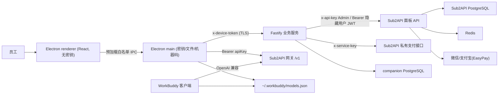
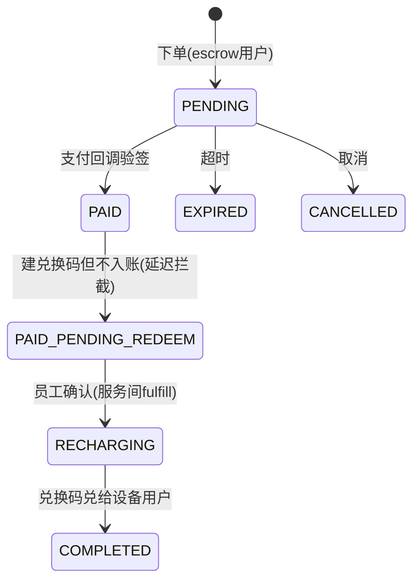

# 架构总览

## 组件与进程边界

关键边界：

- **renderer 永不接触密钥**：apiKey、设备令牌、机器码、解密备份只存在于 Electron main 进程。preload 仅暴露白名单 IPC。
- **管理密钥只在服务器**：全局 Admin Key、服务间 `x-service-key` 只由 companion 持有；桌面端仅持最小权限设备令牌。
- **Sub2API 保持可升级**：仅 `workbuddy-patch` 分支加了最小支付补丁，其余通过官方接口对接。

## 身份模型：设备即账户

- 员工不登录、不采集身份。机器码（Windows `MachineGuid` / macOS `IOPlatformUUID`）经客户端规范化后，由 companion 加盐 HMAC 保存。
- 一台设备 ↔ 一个隐藏 Sub2API 用户 ↔ 一个有效 apiKey。隐藏用户的邮箱/密码、apiKey 以 AES-256-GCM 信封加密存于 companion 库。
- 应用重装：设备令牌存于系统安全存储（DPAPI/Keychain），重装后重新注册即凭机器码 HMAC 找回同一设备并轮换令牌。换机由管理员 CLI 迁移。

## 计费口径

- 1 Sub2API balance = 1 积分（1:1）。
- 当前套餐计费模型：**1 积分 = 1 元，fee=0**。Sub2API 余额订单的 `amount` 同时是「到账额度」和「收款基数」，因此套餐 `points` 必须等于 `price_cny`（CLI 强制校验）。如需折扣，改用 Sub2API 的 `balance_recharge_multiplier` 再扩展。
- 积分总览不展示「总额=已用+剩余」固定等式（退款/返利/冻结会破坏等式），改为展示当前积分、所选时段消耗、累计充值。

## 核心数据流

### 公司码激活

1. main 读机器标识 → companion 注册设备、签发令牌。
2. 员工输入公司码 → companion 校验本地 `code_mappings`（Sub2API 无 dry-run）。
3. companion 经 Admin API 建隐藏用户 → 用户登录取 JWT → `POST /redeem` 消费码 → 建唯一 apiKey 并切到套餐目标分组。
4. apiKey 仅经 TLS 交给 main；renderer 只收到「已激活」。

### 购买与严格延迟入账（补丁核心）

- 订单挂在 companion 的 escrow 用户名下下单，支付成功后 Sub2API 补丁把订单停在 `PAID_PENDING_REDEEM`（只建兑换码、不加余额）。
- 员工在应用内确认后，companion 调服务间 `fulfill`，把兑换码兑给真实设备用户，订单进 `COMPLETED`。
- 幂等：重复回调保持单一 hold；重复确认不重复入账；跨设备领取被 `device_binding` 拒绝。

### 模型配置

1. main 经设备令牌取配置材料（apiKey）+ 服务端模型目录。
2. 用 apiKey 打网关 `GET /v1/models`，与目录按 `id` 取交集，未适配模型隐藏。
3. main 合成条目 → schema 校验 → 加密备份原文件 → 同目录临时文件 + 原子 rename 替换。
4. 提示 WorkBuddy 会热加载，首条消息可能一次 `ACP transport ECONNRESET`，重发即可。

## 技术栈

| 层 | 选型 |
| --- | --- |
| 桌面端 | Electron 43 + React 19 + TypeScript + electron-vite + electron-builder |
| 业务服务 | Node 22 + Fastify 5 + PostgreSQL + zod |
| 上游网关 | Sub2API（Go 1.26.5）v0.1.175 + workbuddy-patch |
| 本地自测 | 便携 PostgreSQL 17、miniredis、假 OpenAI/EasyPay 上游、Node e2e 编排 |
